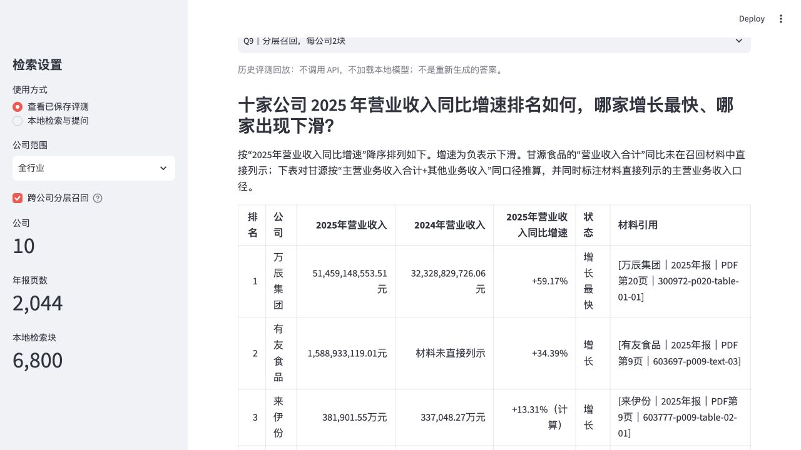
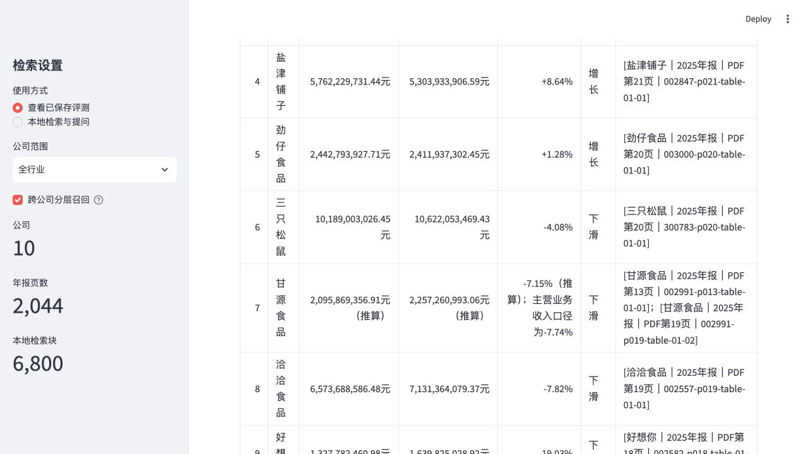
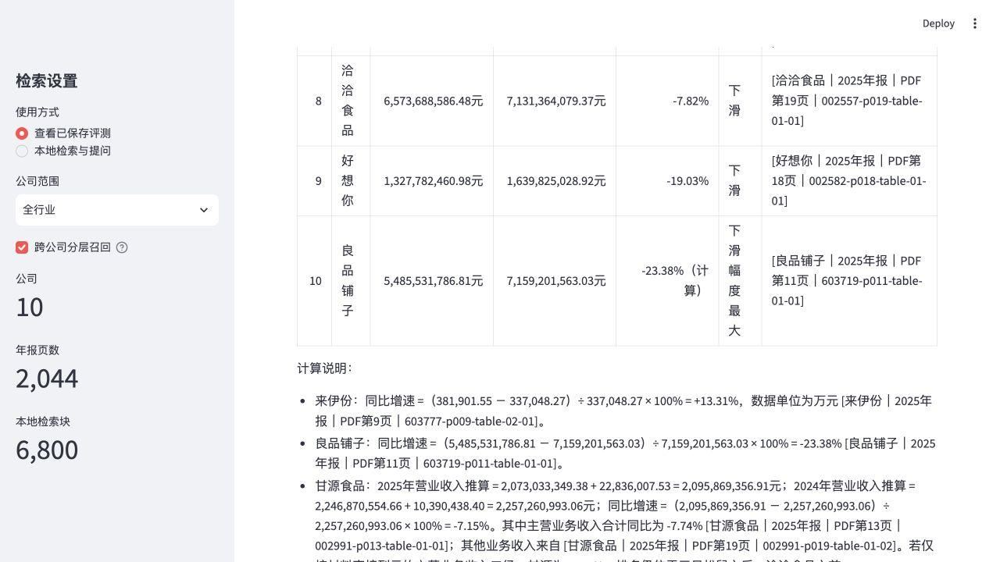

# 万辰集团财报知识问答库

> 基于 10 家休闲食品上市公司 2025 年年报的本地财报 RAG 知识库，支持正文与表格解析、向量与 BM25 混合检索、跨公司分层召回、带 PDF 页码引用的回答以及检索效果评测。

本项目以万辰集团为核心，将万辰集团、三只松鼠、盐津铺子、劲仔食品、甘源食品、洽洽食品、好想你、良品铺子、来伊份和有友食品的年报正文与表格转换为可检索证据块。系统通过 Streamlit 展示答案、引用出处、BM25 排名、向量排名和 RRF 融合结果，使每个结论都能回到真实年报页面核查。

## 项目导航

- [评测结果](evaluation/REVIEW.md)：逐题答案、人工评分、错误分析和证据链接。
- [测试与验证](evaluation/ACCEPTANCE.md)：功能范围、验证结果和已知限制。
- [评测结论](evaluation/ONE_PAGE_CONCLUSION.md)、[评测汇总](evaluation/results.csv)、[原始模型回答](evaluation/model_answers.json) 和下方页面截图。
- 下载项目并安装依赖后，执行 `.venv/bin/streamlit run app.py`，默认进入“查看已保存评测”。无需 PDF、模型、索引或密钥，可切换全部 13 条已保存答案路线，包括 Q10。
- 如需提出新问题，按下文在本机完成建库，然后切换“本地检索与提问”。未建库时页面会显示操作提示。

**本仓库尚未部署公网在线问答网站。** GitHub 展示代码、图片和文档，不会自动运行 Streamlit；`127.0.0.1:8501` 只指向访问者自己的电脑。

## 项目亮点

- **正文与表格逐页解析**：当前实现使用 pdfplumber 顺序提取正文和表格，保留表名、单位、表头和数据行；不并行加载多份报告。
- **可核查的引用**：每个知识块保存公司、章节、PDF 物理页码、内容类型和块 ID，回答可追溯至原始证据。
- **混合检索**：使用 Qwen3-Embedding-0.6B 向量检索和中文 BM25 检索，再通过 RRF 融合两类排名。
- **跨公司分层召回**：对“十家、排名、对比”类问题按公司保底召回，避免少数公司垄断上下文。
- **评测记录可追溯**：回答文件保存实际上下文块 ID、引用和回答全文，检索文件另存原文与排名，人工评价记录正确性和错误类型，包括 Q8、Q9 的基线与分层召回对照。另附按原回答块 ID 回查导出的 95 个证据块，可直接核查原文。两类记录的查询文本可能不同，缺失的历史排名不补造，不将导出证据冒充同次 API 请求日志。
- **安全与可复现**：原始 PDF、模型、索引和 API Key 不进入仓库，通过来源链接、文件名和 SHA-256 校验值保证语料可复现。

## 技术路线

```text
2025 年年报 PDF
    ↓
逐页正文提取 + 表格行列还原
    ↓
分页切块 + 公司/章节/页码元数据
    ↓
Qwen 向量索引 + jieba/BM25 索引
    ↓
RRF 融合 / 跨公司分层召回
    ↓
DeepSeek 基于证据生成带引用答案
    ↓
Streamlit 展示答案、排名、原文与出处
```

## 数据与评测结果

- [x] 确认 10 份 PDF 数量、公司、年份和全文属性
- [x] 记录 PDF 页数与 SHA-256 校验值
- [x] 用万辰集团年报验证正文、表格、章节和页码提取
- [x] 建立万辰单文件向量、BM25 与 RRF 检索，并通过 Q1-Q3 必要证据页 top-8 评测
- [x] 扩展至另外九家公司，完成 2,044 页、6,800 个检索块的自动验收与 20 页人工抽查
- [x] 完成 Streamlit 页面与无密钥启动测试
- [x] 完成 10 道正式题及附加题的真实回答、人工评价和一页结论
- [x] 完成 Q8、Q9 普通 RRF top-8 与每公司保底 2 块的分层召回对照

语料规模为 **10 家公司、2,044 个 PDF 页面、6,800 个检索块**。正式采用的 11 道题中，**8 道正确、3 道部分正确、0 道错误**。Q8、Q9 的对照实验表明：普通 RRF top-8 难以完整覆盖 10 家公司，而按公司分层召回能显著改善跨公司全景问题的证据覆盖。

PDF 不进入 Git；项目通过 `data_manifest.csv` 记录来源、文件名和校验值。其他使用者按清单下载 10 份年报全文，使用清单中的文件名放入项目的 `data/raw/`。程序优先读取该目录，无需复刻作者的电脑路径。找不到时才使用清单原有的 `local_path`；相对路径以项目根目录为基准。

## 环境安装

本项目要求 Python 3.12。在项目根目录执行：

```bash
python3.12 -m venv .venv
.venv/bin/python -m pip install -e .
```

## 项目结构

```text
wanchen-rag/
├── app.py                 # Streamlit 问答页面
├── config/                # jieba 财报词典
├── data_manifest.csv      # 年报清单、来源和校验值
├── evaluation/            # 题目、召回结果、模型回答和结论
├── screenshots/           # 单公司与跨公司页面截图
├── scripts/               # 提取、建库、评测和验收脚本
├── src/wanchen_rag/        # 提取、向量、BM25、RRF 和回答核心代码
└── tests/                 # 自动化测试
```

## 建库、评测与启动

```bash
.venv/bin/python scripts/validate_reports.py
.venv/bin/python scripts/extract_wanchen.py
.venv/bin/python scripts/validate_wanchen_extraction.py
.venv/bin/python scripts/build_wanchen_bm25.py
.venv/bin/python scripts/build_wanchen_vectors.py
.venv/bin/python scripts/evaluate_wanchen_hybrid.py
```

先核对万辰的关键表格与页码，再扩展全库。首次运行 `build_wanchen_vectors.py` 会下载 Qwen 嵌入模型；全库构建复用它的缓存。召回评测出现 `FAIL` 表示某题未召回指定证据页，不等于程序崩溃，应保留并分析失败记录。

```bash
.venv/bin/python scripts/extract_all_reports.py
.venv/bin/python scripts/validate_all_extraction.py
.venv/bin/python scripts/build_full_corpus.py
.venv/bin/python scripts/build_all_bm25.py
.venv/bin/python scripts/build_all_vectors.py
.venv/bin/python scripts/evaluate_cross_company_retrieval.py
.venv/bin/python scripts/build_financial_rankings.py
.venv/bin/python scripts/build_evaluation_results.py
.venv/bin/python -m unittest discover -s tests -v
```

最后单独启动页面（此命令会持续运行，终端不再继续执行后续命令）：

```bash
.venv/bin/streamlit run app.py --server.address 127.0.0.1 --server.port 8501
```

已完整存在的向量索引不会自动覆盖。无需为了查看历史评测重新建库。若修改原始语料，应另行备份并明确安排索引重建，不能混用新语料和旧向量。

提取结果保存在 `data/processed/300972/`，其中：

- `pages.jsonl`：逐页清洗后的正文；
- `tables.jsonl`：表格原始行列、表名、单位和页码；
- `chunks.jsonl`：供后续 BM25 与向量索引使用的正文块、表格块。

全库自动验收与 20 页人工抽查记录见 `evaluation/CORPUS_QA.md`。
十道正式题和一道单位陷阱附加题见 `evaluation/questions.jsonl`，人工参考答案见 `evaluation/WANCHEN_Q1_Q7_REFERENCE.md`、`evaluation/Q8_Q9_REFERENCE.md` 和 `evaluation/Q10_REFERENCE.md`。

“查看已保存评测”不访问密钥或调用 API，题目及公司范围固定绑定历史记录；侧栏公司选择只用于实时检索。“本地检索与提问”需要本地索引和模型缓存，无密钥时只展示证据，不与历史答案混搭。需要生成新答案时，请由用户本人在启动命令所在的终端配置 `DEEPSEEK_API_KEY`。默认模型为 `deepseek-flash`；如需更换，可配置非秘密变量 `DEEPSEEK_MODEL`。项目不保存、显示或记录密钥。
如需补齐缺失或接口失败的回答，由用户本人在已配置密钥的终端执行 `.venv/bin/python scripts/run_answer_evaluation.py`。脚本会断点续跑，并为 Q8、Q9 分别保存普通 RRF top-8 基线和分层召回答案，共形成 13 条回答路线记录。已有成功返回的答案（包括人工判定为部分正确或错误的答案）会跳过，不重复计费；接口失败单独记录在 `generation_error`，不与人工评价的 `error_type` 混用。新请求会产生 API 费用，结果写入 `evaluation/model_answers.json`，不会写入密钥。重新生成后的答案必须重新人工评价，不能直接套用旧结论。

`evaluation/results.csv` 保存 14 条召回/回答路线的覆盖情况、正确性判定和错误类别。按正式采用的 11 道题路线统计，8 道正确，Q6、Q7、Q10 为部分正确。`data_manifest.csv` 已补齐 10 份年报的披露日期和官方来源网址。

新生成记录的人工评价需在 `manual_evaluations.json` 对应条目中附上 `answer_sha256`（回答全文 UTF-8 字节的 SHA-256），汇总脚本只接受与当前回答匹配的评价。已有历史记录保持兼容；此检查防止旧评分被误套到重新生成的答案上。

## 页面截图

- [语料统计](screenshots/01_corpus_stats.jpg)：10 家公司的年报页数和检索块统计。
- [单公司回答](screenshots/02_single_company_retrieval.jpg)：万辰集团门店数问题的带引用答案。
- [跨公司回答页首](screenshots/03_cross_company_retrieval.jpg)：原版问答页面。
- [跨公司检索过程](screenshots/04_cross_company_retrieval_process.jpg)：BM25、向量与 RRF 排名过程。
- [单公司检索过程](screenshots/05_single_company_retrieval_process.jpg)：召回排名和原文出处入口。
- 修复版历史回放中的完整 Q9 排名分三张展示：[第 1–3 名](screenshots/06_saved_q9_ranking_1.jpg)、[第 4–8 名](screenshots/07_saved_q9_ranking_2.jpg)、[末段排名与计算说明](screenshots/08_saved_q9_ranking_3.jpg)。历史答案原文保持不变。

前五张为原版页面存档；文件内容实际为 JPEG，现已统一修正扩展名，未修改图片内容。

### 单公司问答


### 跨公司问答与召回过程








## 局限性

- 本地验证通过不代表所有机器、网络和依赖版本都已验证。历史评测可直接阅读；新问题的实时问答仍需自行建库和配置回答服务。
- 历史检索评测与回答使用的部分查询措辞不同。证据全文可按原回答块 ID 回查，但不能从现有记录恢复每一次 API 请求的全部原始排名；缺失项保持空白。
- 财务表格存在“元、千元、万元”及合并/母公司口径差异，生成答案前仍需核对单位和表头。
- 跨公司问题需要更多上下文，分层召回可以提高覆盖率，但不能保证每个口径都完全一致。
- 当召回证据不足时，系统要求模型明确说明材料未覆盖，而不是使用常识补全。

## 项目标签

`RAG` `financial-reports` `knowledge-base` `hybrid-search` `BM25` `Qwen-Embedding` `Streamlit` `Python` `annual-report` `Chinese-NLP`

## 安全约束

DeepSeek 密钥由用户本人通过 `DEEPSEEK_API_KEY` 配置。项目代码、日志、页面和截图不得保存或显示密钥值。
